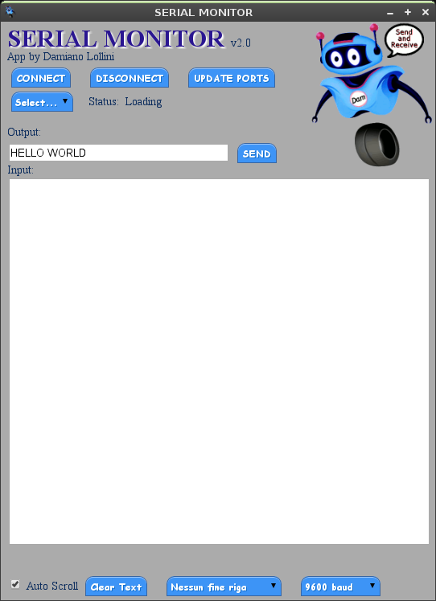

Serial Monitor
====================

App for browser chrome.
Monitor and write to USB-serial devices from chrome like Arduino over USB.
This app works just like the Arduino serial monitor.

It uses serial APIs to create **serial communication** using just **Javascript**.

More info about serial APIs:  
http://developer.chrome.com/apps/serial.html

	git clone git@github.com:damnemo/serial_monitor.git
	git clone git://github.com/damnemo/serial_monitor.git

## Install Chrome App
 1. Download ZIP and extract.
 2. Go to Chrome's `Tools -> Extensions` or digit in the omnibar
    `chrome://extensions/`. 
 3. Check `Developer Mode`, a developer toolbar
    will appear.  
 4. Click `Load unpacked extension...`. You’ll be asked
    to select the path of the extensions.  
 5. Click on directory `serial_monitor` 
 6. You’ll then see it in your list of extensions.
 7. In Extensions page click `launch` to get it working.

### Image Preview

